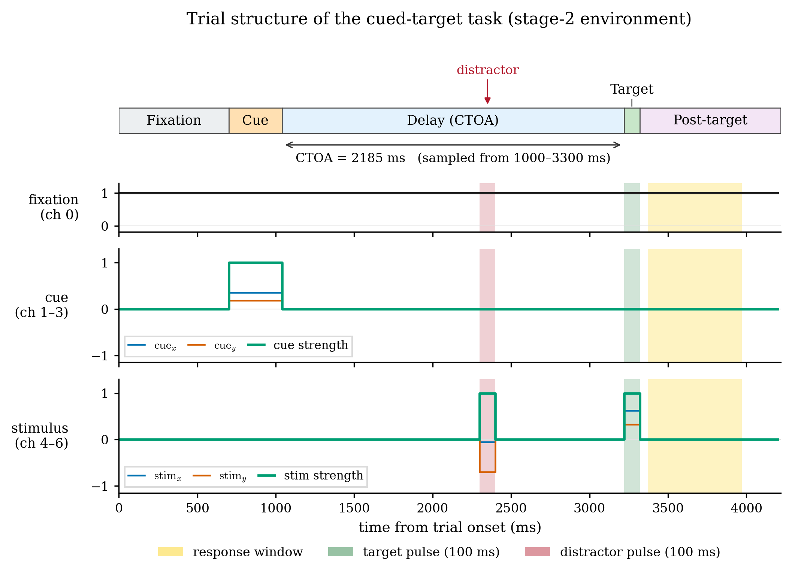

# Leaky RNN with Dale's Law


A biologically-constrained leaky recurrent network trained on a cued visuospatial
detection task. The network holds fixation through a randomized delay, ignores
distractor flashes, and releases only when a target appears at the spatially pre-cued
location. It implements an excitatory/inhibitory split with Dale's law, sparse
connectivity, and recurrent noise, and develops rotational population dynamics of the
kind observed in primate prefrontal/parietal cortex during cued detection.

<p align="center">
  
</p>
<p align="center">
  <em>Trial structure: cue → randomized cue-to-target delay (with distractors) → target → response.</em>
</p>

## The task

A custom [neurogym](https://github.com/neurogym/neurogym) environment
(`CuedTargetWithDistractorsV3`). Each trial:

- A **cue** marks one of four screen locations.
- After a randomized **cue-to-target onset asynchrony (CTOA, 1000–3300 ms)**, a
  **target** appears at the cued location; the network must release within a valid
  reaction-time window.
- During the delay, **distractors** may flash at uncued locations and must be ignored
  (a response to one is a false alarm).

The observation is a 7-channel stream (fixation, cue x/y/strength, stimulus
x/y/strength) sampled at 20 ms. Solving the task requires integrating spatial
working memory (cue location) with temporal expectation (the CTOA hazard).

## Models

| Model | File | Description |
|---|---|---|
| **`BioLeakyRNN`** | `src/model.py` | Base model. E/I sign constraints enforced via a fixed `ei_sign` vector on `W_rec`. Trained in three stages: target-only → add cue → add distractors, with early stopping. |
| **`BioLeakyRNNTopo`** | `src/model_topo.py` | Topographic variant. Excitatory units sit on a 2-D sheet, inhibitory units at random positions; inputs are frozen Gaussian receptive fields and recurrent connectivity falls off with sheet distance. Forces the network to use spatial structure rather than timing shortcuts, yielding interpretable activity maps and spatial decoders. |

The topographic E/I sheet architecture follows Chen & Gong (2022).

## Repository layout

```
src/            Model, task environment, training loop, analysis & plotting
notebooks/      Analysis pipeline, grouped by model variant (see below)
checkpoints/    Empty; trained weights ship via GitHub Releases
figures/        Trial-structure schematic; result figures are regenerated by notebooks
scripts/        Helper utilities (e.g. strip notebook outputs)
run_stage0.py   Stand-alone entry point for stage-0 training
```

## Installation

```bash
conda create -n rnn-env python=3.10 -y && conda activate rnn-env
pip install torch --index-url https://download.pytorch.org/whl/cu128
pip install "neurogym @ git+https://github.com/neurogym/neurogym.git"
pip install -r requirements.txt
```

CPU is sufficient — and faster than GPU at this network size (`hidden_size≈128–180`).

## Quickstart

1. Install (above).
2. Download the trained checkpoints from the latest
   [GitHub Release](../../releases) into `checkpoints/`.
3. Open any analysis notebook, e.g. `notebooks/2_rnn_topo/state_space.ipynb`,
   and run it top to bottom. Each notebook's first cell locates the repository root
   automatically, so it runs correctly from its subfolder.

To retrain instead of downloading weights, start with the `train.ipynb` inside the
relevant model folder.

## Notebook pipeline

Notebooks are grouped by model variant — each folder contains training and all
analyses for that model. Outputs are stripped from version control; running a notebook
regenerates its figures into `figures/`.

### `0_task` — task visualization
| Notebook | Purpose |
|---|---|
| `trial_structure` | Render the trial-structure schematic |

### `1_rnn_baseline` — non-topographic baseline (BioLeakyRNN)
| Notebook | Purpose |
|---|---|
| `train` | 3-stage curriculum training |
| `state_space` | PCA trajectories, dPCA variance split |
| `jpca` | jPCA rotational subspace (3 vs 6 PCA dims) |
| `tangling` | Trajectory tangling vs CTOA, RT correlation |
| `oscillations` | W_rec eigenspectrum, Jacobian, PSD, jPCA frequency |
| `stimulus_robustness` | Performance under degraded inputs |
| `position_decoding` | Location decoding accuracy vs CTOA |

### `2_rnn_topo` — topographic model with Dale's law (BioLeakyRNNTopo) ← main model
| Notebook | Purpose |
|---|---|
| `train` | 3-stage curriculum training on topographic architecture |
| `pretrain_finetune` | Spatial pretraining on a simpler environment, then fine-tune |
| `state_space` | PCA trajectories, dPCA variance split |
| `jpca` | jPCA rotational subspace (3 vs 6 PCA dims) |
| `tangling` | Trajectory tangling vs CTOA, RT correlation |
| `oscillations` | W_rec eigenspectrum, Jacobian, PSD, jPCA frequency |
| `spatial_activity` | Activity maps, linear spatial decoder, COM drift, ablations |
| `dimensionality_evolution` | Tangling and effective dimensionality across training stages |
| `diagnostics` | Unit selectivity, sheet maps, lesion tests |

### `3_rnn_topo_spatial` — topographic model with 2D spatial output
| Notebook | Purpose |
|---|---|
| `train` | Training with continuous 2D readout instead of go/no-go |
| `state_space` | PCA/dPCA for the spatial-output variant |
| `tangling` | Trajectory tangling vs CTOA |
| `spatial_activity` | Activity maps and decoder for spatial-output model |
| `dimensionality_evolution` | Dimensionality evolution across training stages |

### `4_rnn_topo_discrete` — topographic model with 4 discrete target locations
| Notebook | Purpose |
|---|---|
| `train` | Training on discrete 4-quadrant locations |
| `dimensionality_evolution` | Tangling and dimensionality evolution (discrete variant) |

### `5_rnn_sameloc` — topographic model, cue and target at the same location
| Notebook | Purpose |
|---|---|
| `train` | Training where cue position predicts exact target position |
| `state_space` | PCA/dPCA, location selectivity |
| `dynamics` | Tangling, PR, dPCA split for the sameloc model |
| `position_coding` | Per-neuron position tuning, difference maps, normalization |

## Trained weights

Checkpoints (`.pt`) are attached to the latest [GitHub Release](../../releases).
Download them into `checkpoints/`, or retrain from scratch with the `train.ipynb`
inside each model folder.

## References

- Chen & Gong (2022) — topographic E/I sheet architecture.
- Churchland et al. (2012) — jPCA / rotational dynamics.
- Russo et al. (2018) — trajectory tangling.

## License

Released under the MIT License — see [LICENSE](LICENSE).
